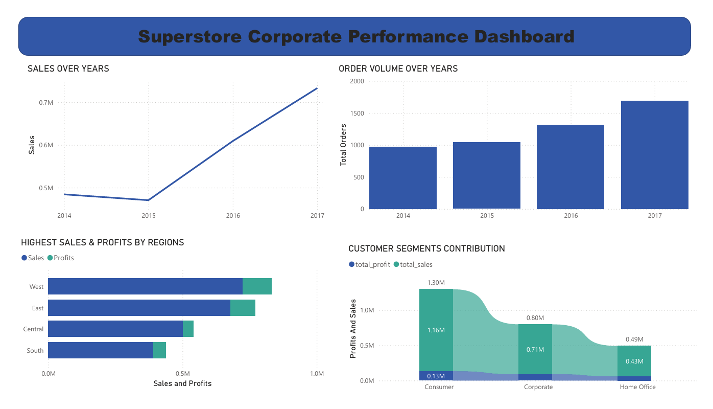
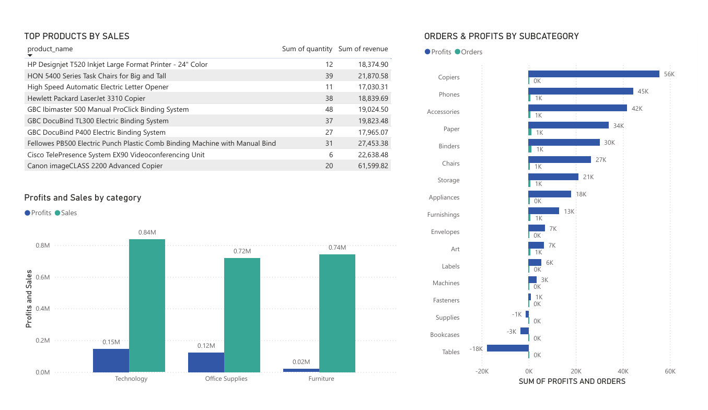

# Superstore Sales Analysis Dashboard

## Project Overview

This project analyzes Superstore sales data to identify business trends, product performance, customer behavior, regional insights, and operational inefficiencies using Excel Power Query, PostgreSQL, and Power BI.

The project follows a complete end-to-end data analytics workflow including:
- Data understanding
- Data cleaning
- SQL analysis
- Dashboard creation
- Business insights and recommendations

---

## Tools & Technologies Used

- Excel Power Query – Data Cleaning & Transformation
- PostgreSQL – SQL Analysis
- Power BI – Dashboard Visualization
- Kaggle – Dataset Source

---

## Project Workflow

1. Downloaded Superstore dataset from Kaggle
2. Categorized columns into:
   - Numerical
   - Categorical
   - Geographic
   - Date/Time
   - Identifier columns
3. Created 15 business questions for analysis
4. Cleaned and transformed data using Excel Power Query
5. Performed SQL analysis in PostgreSQL
6. Built interactive dashboards in Power BI
7. Generated business insights and recommendations

---

## Business Questions Covered

- Sales trend over years
- Order volume analysis
- Category & sub-category performance
- Regional & city analysis
- Customer analysis
- Product performance analysis
- Discount impact on profitability
- Shipping duration analysis
- Segment-wise product preferences

---

## Dashboard Pages

### 1. Executive Overview Dashboard
- Sales trends
- Order trends
- Regional performance
- Segment contribution

### 2. Product Performance Dashboard
- Category analysis
- Sub-category analysis
- Top products
- Product preferences by customer segments

### 3. Customer & Geographic Dashboard
- Top customers
- Regional customer distribution
- City performance analysis

### 4. Operational Insights Dashboard
- Discount vs Profit analysis
- Shipping duration analysis
- Operational efficiency insights

### 5. Insights & Recommendations Page
- Key business insights
- Strategic recommendations

---

## Key Insights

- Technology category generated the highest profit
- West region contributed the highest overall sales and profits
- Higher discounts negatively impacted profitability
- Some cities underperformed despite high order volumes
- Shipping duration varied across regions and categories

---

## Business Recommendations

- Optimize discount strategies for low-margin products
- Improve logistics efficiency in delayed regions
- Focus marketing on high-performing customer segments
- Increase inventory investment in profitable product categories

---

## Project Files

| Folder | Description |
|--------|-------------|
| Dataset | Raw and cleaned datasets |
| SQL | SQL analysis queries |
| PowerBI | Power BI dashboard file |
| Reports | Insights & recommendations report |
| Dashboard_Screenshots | Dashboard preview images |

---

## Dashboard Preview

(Add dashboard screenshots here)

Example:

---

## Author

Raghuram Beldon
